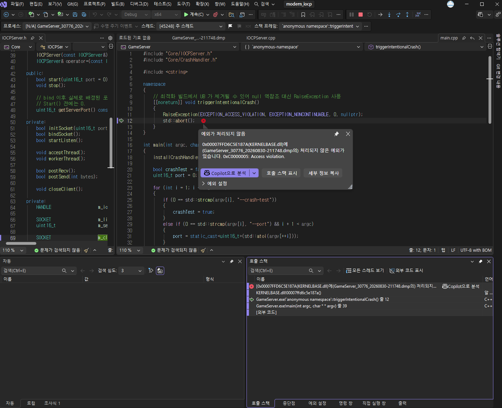
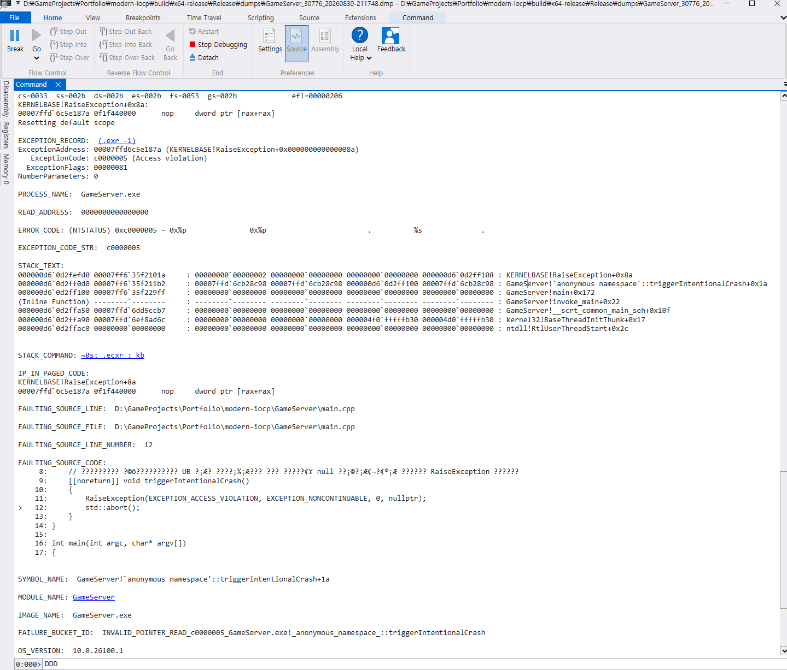
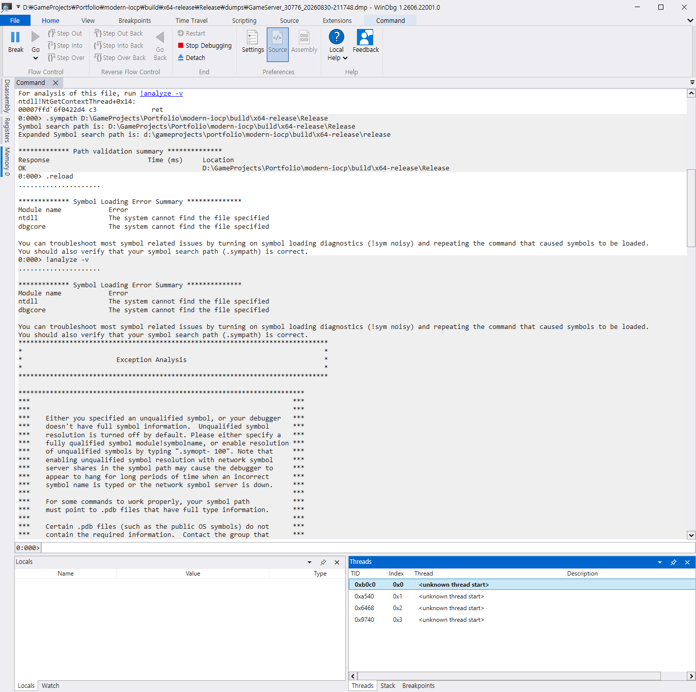
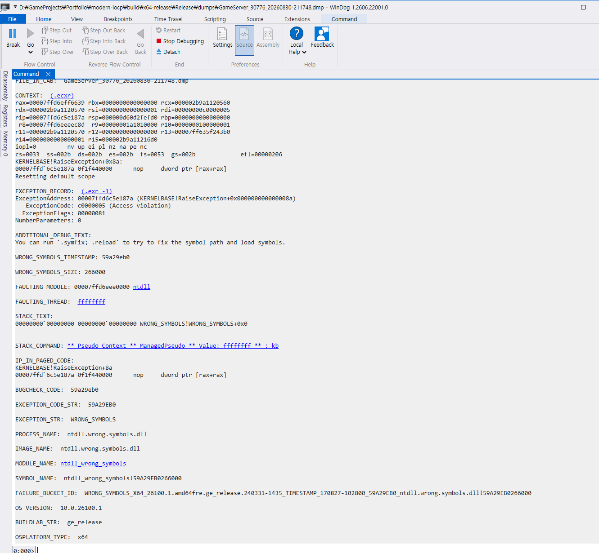

# 덤프 분석 00 — 배관 검증

- 대상 덤프: `build/x64-release/Release/dumps/GameServer_30776_20260830-211748.dmp`
- 심볼: `build/x64-release/Release/GameServer.pdb` (2026-08-30 21:17:27 빌드)
- 도구: Visual Studio 2026 / WinDbg 1.2606.22001.0
- 작성: 2026-08-30

## 이 문서의 범위

**의도적으로 일으킨 크래시로 덤프 파이프라인이 동작하는지만 확인한다.**
근본 원인 분석은 하지 않는다 — 원인이 자명하기 때문이다. 실제 결함 분석은 S6 에서 한다.

보장하는 것은 **심볼이 붙은 호출 스택까지**다. x64 Release 빌드라 인라인 확장과 프레임
포인터 생략이 일어나므로 지역 변수 값과 완전한 프레임 복원은 보장 대상이 아니다.

## 재현

```powershell
cd D:\GameProjects\Portfolio\modern-iocp
.\scripts\phase1.ps1 crash
```

`GameServer.exe --crash-test` 가 `GameServer/main.cpp` 의 `triggerIntentionalCrash()` 에서
`RaiseException(EXCEPTION_ACCESS_VIOLATION, EXCEPTION_NONCONTINUABLE, 0, nullptr)` 를 호출한다.
`Core/CrashHandler.cpp` 의 `SetUnhandledExceptionFilter` 핸들러가 `MiniDumpWriteDump`
(`MiniDumpNormal`)로 덤프를 쓰고 경로를 표준출력에 남긴다.

```
[CRASH] dump written: D:\...\Release\dumps\GameServer_30776_20260830-211748.dmp
```

`.\scripts\phase1.ps1 verify-dump` 가 이 줄을 파싱해 덤프 파일과 짝 PDB 존재를
종료 코드로 판정한다. 사람 눈이 아니라 exit code 가 판정 근거다.

## Visual Studio

`.dmp` 를 열고 "네이티브 전용으로 디버그" → 호출 스택(`Ctrl+Alt+C`).



```
  KERNELBASE.dll!00007ffd6c5e187a()                                알 수 없음
> GameServer.exe!`anonymous namespace'::triggerIntentionalCrash()  줄 12   C++
  GameServer.exe!main(int argc, char * * argv)                     줄 39   C++
  [외부 코드]
```

`GameServer.exe` 프레임에 함수 이름과 줄 번호가 붙었다. Release 빌드에 `/Zi` 와 링커
`/DEBUG` 를 건 결과다.

`KERNELBASE.dll` 이 "알 수 없음" 인 것은 MS 공개 심볼을 설정하지 않았기 때문이며,
이 단계에서는 문제가 되지 않는다.

## WinDbg

```
.symfix
.sympath+ D:\GameProjects\Portfolio\modern-iocp\build\x64-release\Release
.reload /f
!analyze -v
.ecxr
k
```



```
PROCESS_NAME:  GameServer.exe
SYMBOL_NAME:   GameServer!`anonymous namespace'::triggerIntentionalCrash+1a
FAULTING_SOURCE_LINE_NUMBER:  12

STACK_TEXT:
  KERNELBASE!RaiseException+0x8a
  GameServer!`anonymous namespace'::triggerIntentionalCrash+0x1a
  GameServer!main+0x172
  (Inline Function) GameServer!invoke_main+0x22
  GameServer!__scrt_common_main_seh+0x10f
  kernel32!BaseThreadInitThunk+0x17
  ntdll!RtlUserThreadStart+0x2c
```

`.symfix` 로 MS 심볼을 받았으므로 `kernel32` · `ntdll` 프레임에도 이름이 붙는다.
PDB 에 소스 경로가 들어 있어 `FAULTING_SOURCE_CODE` 로 해당 줄까지 표시된다.

---

## 겪은 함정

이 절이 이 문서의 실질적인 내용이다. 셋 다 실제로 밟았다.

### 1. `.sympath` 만 지정하면 `!analyze -v` 가 무너진다

처음에는 우리 출력 폴더만 심볼 경로로 지정했다.

```
.sympath D:\GameProjects\Portfolio\modern-iocp\build\x64-release\Release
```



```
Symbol Loading Error Summary
Module name   Error
ntdll         The system cannot find the file specified
dbgcore       The system cannot find the file specified
```

`!analyze -v` 는 OS 심볼에 의존하므로 결과 전체가 틀어졌다.



```
PROCESS_NAME:  ntdll.wrong.symbols.dll
STACK_TEXT:    WRONG_SYMBOLS!WRONG_SYMBOLS+0x0
```

프로세스 이름부터 사실이 아니다. `.symfix` 로 MS 심볼 서버를 먼저 잡고, 우리 경로는
`.sympath+` 로 **추가**해야 한다. `.sympath` 는 덮어쓰기다.

Visual Studio 는 같은 상황에서 정상 동작했다. 실행 파일 옆 PDB 를 자동으로 찾고,
없는 모듈은 "알 수 없음" 으로 두고 넘어가기 때문이다. 자동 분석을 하지 않으니 무너질 것도 없다.

### 2. `k` 는 크래시 스택이 아니라 덤프 작성 스택을 보여준다

`!analyze -v` 직후 `k` 를 치면 이렇게 나온다.

```
00  ntdll!NtGetContextThread+0x14
01  dbgcore!TraceLoggingRegister_EventRegister_2U
```

`triggerIntentionalCrash` 가 없다. 덤프에 저장된 스레드 컨텍스트는 **크래시 시점이 아니라
`MiniDumpWriteDump` 를 호출하던 시점**이기 때문이다. 크래시 시점의 레지스터는 예외 레코드에
따로 들어 있고, `.ecxr` 로 그 컨텍스트로 전환해야 한다.

`!analyze -v` 도 같은 것을 알려준다.

```
STACK_COMMAND:  ~0s; .ecxr ; kb
```

**이것은 자기 프로세스가 자기 덤프를 쓰는 방식의 직접적인 결과다.** 감시 프로세스가 밖에서
덤프를 뜨면 덤프 작성 코드가 스택에 섞이지 않는다.

### 3. `INVALID_POINTER_READ` 는 오판이다

```
AV.Dereference:  NullPtr
READ_ADDRESS:    0000000000000000
FAILURE_BUCKET_ID:  INVALID_POINTER_READ_c0000005_GameServer.exe!...
```

이 코드는 널 포인터를 역참조한 적이 없다. `RaiseException` 으로 예외 코드만 던졌다.
근거는 같은 출력 안에 있다.

```
ExceptionCode: c0000005 (Access violation)
NumberParameters: 0
```

진짜 액세스 위반이면 CPU 가 접근 종류와 주소를 파라미터 2개로 채운다. 우리는 파라미터를
0개로 넘겼고, `!analyze` 는 없는 값을 0 으로 읽어 "주소 0 을 읽으려다 실패" 로 추정했다.

**`!analyze -v` 의 버킷 이름과 요약은 휴리스틱이다.** 판단 근거는 `ExceptionCode`,
`NumberParameters`, 호출 스택 같은 원시 데이터에서 직접 확인해야 한다.

---

## 부수 관찰

- **호출 스택의 줄 번호는 실제 호출 지점의 다음 줄이다.** 크래시는 `main.cpp:11` 의
  `RaiseException` 에서 났지만 스택은 12 를 가리킨다. 스택에 쌓이는 것이 반환 주소이기
  때문이다. 가장 안쪽 프레임만 실제 실행 지점이다.
- **WinDbg 소스 창에서 한글 주석이 깨진다.** 소스를 UTF-8 with BOM 으로 저장했는데
  WinDbg 가 ANSI 로 읽는다. Visual Studio 에서는 정상이다.
- **`(Inline Function) GameServer!invoke_main+0x22`** — Release 최적화로 인라인된 함수를
  PDB 의 인라인 정보로 복원한 것이다. 이 문서 서두에서 보장 범위를 스택까지로 제한한 이유다.
- `WARNING: Unable to verify checksum for GameServer.exe` 는 PE 체크섬 필드가 비어 있다는
  뜻으로, 서명하지 않은 로컬 빌드에서는 정상이다.

## 알려진 한계

- **자기 프로세스가 자기 덤프를 쓴다.** 힙이 손상된 상태면 `MiniDumpWriteDump` 자체가
  실패할 수 있다. 실무 해법은 감시 프로세스가 밖에서 뜨는 것이다. S1 은 파이프라인 검증이
  목적이므로 이 방식을 택했다.
- **스택 오버플로는 잡지 못한다.** 핸들러도 스택을 필요로 한다.
  `SetThreadStackGuarantee` 로 완화할 수 있으나 S1 범위 밖이다.
- `SetUnhandledExceptionFilter` 는 SEH 예외만 받는다. C++ `throw` 미처리
  (`std::set_terminate`), 순수 가상 호출(`_set_purecall_handler`), CRT 잘못된 인자
  (`_set_invalid_parameter_handler`) 는 별도 등록이 필요하다. 필요해질 때 추가한다.
- **PDB 는 그 바이너리 전용이다.** 재빌드하면 기존 덤프와 짝이 맞지 않는다. 여러 빌드를
  운영하려면 심볼 서버가 필요하다.
